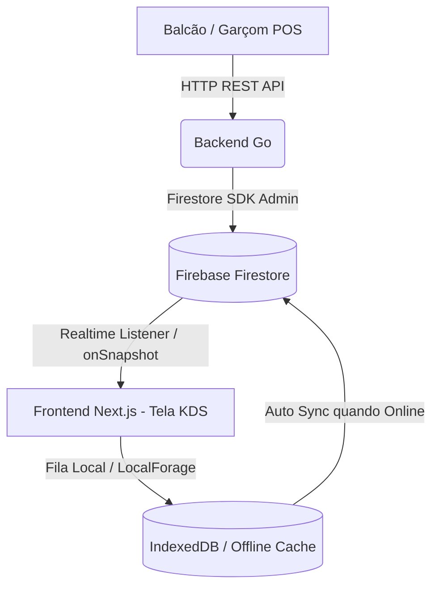

# 🍳 KitchenSoft - Kitchen Display System (KDS)

O **KitchenSoft** é uma solução completa de **Kitchen Display System (KDS)** e Gestão de Pedidos para cozinhas de restaurantes e estabelecimentos alimentícios. O sistema substitui as comandas de papel tradicionais por telas digitais inteligentes e reativas, otimizando o fluxo de produção, reduzindo o tempo de espera e eliminando erros operacionais na cozinha.

---

## 📌 1. Visão Geral do Projeto

O **KitchenSoft** conecta o balcão de atendimento e canais de pedidos diretamente com a equipe de produção na cozinha. 

- **Substituição de Comandas Impressas:** Transforma pedidos em cards digitais interativos com temporizadores inteligentes de SLA (*Service Level Agreement*).
- **Tempo Real Extremo:** Atualização instantânea de status entre garçons, balcão e cozinheiros.
- **Eficiência Operacional:** Agrupamento automático de itens semelhantes (lotes/batches) para preparar múltiplos pedidos simultaneamente.
- **Resiliência e Continuidade:** Operação *offline-first* no frontend para que a cozinha continue funcionando mesmo durante oscilações ou quedas de conexão com a internet.

---

## 🏗️ 2. Arquitetura Geral do Sistema

O projeto é estruturado no modelo **Monorepo**, dividindo responsabilidades entre uma API REST resiliente em Golang e uma interface de usuário moderna em Next.js, sincronizadas em tempo real via Firebase.



### Componentes Principais:
1. **Backend (Go / Golang):**
   - API de alta performance para criação, gestão e transição de estados dos pedidos.
   - Integração segura com o Firebase Admin SDK (Cloud Firestore e Realtime Database).
   - Validações de regras de negócio, gerenciamento de estoque/lotes e exposição de endpoints REST.
2. **Frontend (Next.js 16 + React 19 + Zustand):**
   - Interface KDS e Balcão de Pedidos projetada para telas de toque e monitores industriais em **Dark Mode**.
   - Sincronização em tempo real (*onSnapshot*) com Firestore.
   - Gestão de estado global com **Zustand** e persistência local offline com **LocalForage** (IndexedDB).
3. **Firebase Firestore:**
   - Banco de dados NoSQL em tempo real atuando como canal unificado de eventos entre o backend e a interface visual.

---

## 📁 3. Estrutura do Repositório

```text
kitchenSoft/
├── backend/                  # Servidor API REST em Go (Golang)
│   ├── cmd/
│   │   └── server/           # Ponto de entrada da aplicação Go (main.go)
│   ├── internal/
│   │   ├── firebase/         # Inicialização do Firebase Admin SDK
│   │   ├── handler/          # Handlers de rotas HTTP REST
│   │   ├── model/            # Structs de dados (Order, Item, Batch, Status)
│   │   └── service/          # Camada de regras de negócio e persistência
│   ├── .env                  # Variáveis de ambiente do backend
│   ├── go.mod                # Módulo e dependências Go
│   └── serviceAccountKey.json # Credenciais de Admin do Firebase (exemplo/local)
│
├── frontend/                 # Aplicação Web Next.js (App Router)
│   ├── src/
│   │   ├── app/              # Páginas e rotas do App Router (KDS, Balcão, etc.)
│   │   ├── components/       # Arquitetura Atomic Design
│   │   │   ├── atoms/        # Botões, Badges, Typographies, Ícones
│   │   │   ├── molecules/    # ItemCard, Timer, ActionButtons
│   │   │   ├── organisms/    # OrderCard, HeaderBar, NavigationFilter
│   │   │   └── templates/    # KitchenGridTemplate, KDSLayout
│   │   ├── hooks/            # Custom Hooks (useOrders, useOfflineQueue)
│   │   ├── lib/              # Configurações do Firebase SDK Client e LocalForage
│   │   ├── store/            # Gerenciamento de estado com Zustand
│   │   └── types/            # Interfaces e Tipos TypeScript
│   ├── .env.local            # Variáveis de ambiente do frontend
│   ├── package.json          # Dependências e scripts Node.js
│   └── tsconfig.json         # Configuração do TypeScript
│
└── README.md                 # Documentação principal do repositório
```

---

## ⚡ 4. Principais Funcionalidades

- 📺 **Painel KDS em Tempo Real:** Visualização contínua de pedidos divididos por colunas de status (*Pendente*, *Em Preparo*, *Pronto*, *Entregue*).
- 📦 **Agrupamento em Lotes (Batches):** Agrupa automaticamente itens idênticos de pedidos diferentes (ex: "5x Batatas Fritas") para otimizar o tempo de fritura/chapa da equipe.
- 📡 **Suporte Offline com Fila de Sincronização:** Alterações efetuadas sem acesso à internet são salvas em fila local e reenviadas automaticamente quando a conexão é restabelecida.
- 🍽️ **Balcão de Pedidos (Order Counter / POS):** Interface para entrada rápida de novos pedidos, personalização de itens e envio imediato para a cozinha.
- ⏱️ **Gestão de SLA e Alertas Visuais:** Alertas com variação de cores (verde, amarelo, vermelho) indicando o tempo decorrido de cada pedido conforme metas configuradas.

---

## 🔧 5. Requisitos Prévios & Instruções de Configuração/Execução

### 📋 Requisitos Prévios
Certifique-se de ter instalado em sua máquina:
- **Node.js**: v18.x ou v20.x+
- **npm**: v9.x+ (ou `pnpm` / `yarn`)
- **Go (Golang)**: v1.22+
- **Conta no Firebase**: Projeto configurado no Firebase Console com Firestore ativado.

---

### 🚀 Executando o Backend (Go)

1. Navegue até o diretório do backend:
   ```bash
   cd backend
   ```

2. Instale as dependências Go:
   ```bash
   go mod download
   ```

3. Certifique-se de possuir o arquivo `.env` configurado e o arquivo de credenciais do Firebase (`serviceAccountKey.json`).

4. Inicie o servidor Go:
   ```bash
   go run ./cmd/server
   ```
   *O backend estará rodando por padrão na porta `8585` (ou na definida no `.env`).*

---

### 💻 Executando o Frontend (Next.js)

1. Navegue até o diretório do frontend:
   ```bash
   cd frontend
   ```

2. Instale as dependências Node.js:
   ```bash
   npm install
   ```

3. Crie e configure o arquivo `.env.local` na raiz de `/frontend` (veja o guia de variáveis abaixo).

4. Execute o servidor de desenvolvimento:
   ```bash
   npm run dev
   ```
   *O frontend estará disponível em `http://localhost:3000`.*

---

## 🔑 6. Guia de Variáveis de Ambiente (`.env`)

### ⚙️ Backend (`/backend/.env`)

Crie um arquivo `.env` no diretório `/backend`:

```env
# Porta de execução da API REST em Go
PORT=8585

# Caminho para as credenciais da Service Account do Firebase Admin
FIREBASE_CREDENTIALS_PATH=./serviceAccountKey.json

# URL do Realtime Database (opcional/se utilizado)
FIREBASE_DATABASE_URL=https://kitchen-soft-default-rtdb.firebaseio.com
```

### 💻 Frontend (`/frontend/.env.local`)

Crie um arquivo `.env.local` no diretório `/frontend`:

```env
# Configurações do Firebase Client Web SDK
NEXT_PUBLIC_FIREBASE_API_KEY=sua_api_key_aqui
NEXT_PUBLIC_FIREBASE_AUTH_DOMAIN=seu-projeto.firebaseapp.com
NEXT_PUBLIC_FIREBASE_DATABASE_URL=https://seu-projeto-default-rtdb.firebaseio.com
NEXT_PUBLIC_FIREBASE_PROJECT_ID=seu-projeto-id
NEXT_PUBLIC_FIREBASE_STORAGE_BUCKET=seu-projeto.firebasestorage.app
NEXT_PUBLIC_FIREBASE_MESSAGING_SENDER_ID=1234567890
NEXT_PUBLIC_FIREBASE_APP_ID=1:1234567890:web:abcdef123456
NEXT_PUBLIC_FIREBASE_MEASUREMENT_ID=G-XXXXXXXXXX

# URL do Backend Go
NEXT_PUBLIC_GO_BACKEND_URL=http://localhost:8585
```

---

## 📝 Licença

Este projeto é desenvolvido para fins de estudo e gestão de cozinhas comerciais. Todos os direitos reservados.