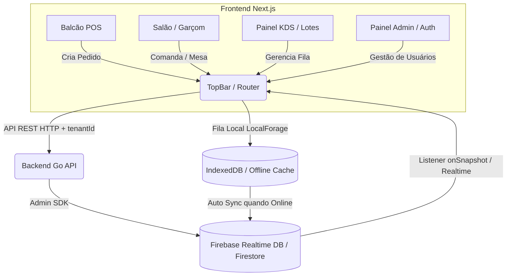

Produção: https://kitchensoft-app--kitchen-soft.us-east4.hosted.app/

# 🍳 KitchenSoft - Kitchen Display System (KDS) & Gestão de Restaurantes

O **KitchenSoft** é uma solução completa de **Kitchen Display System (KDS)**, **Gestão de Salão/Garçom** e **Balcão de Pedidos** para cozinhas de restaurantes e estabelecimentos alimentícios. O sistema substitui as comandas de papel tradicionais por telas digitais inteligentes e reativas, otimizando o fluxo de produção, reduzindo o tempo de espera e eliminando erros operacionais.

---

## 📌 1. Visão Geral do Projeto

O **KitchenSoft** conecta o balcão de atendimento, garçons no salão e canais digitais de pedidos diretamente com a equipe de produção na cozinha com suporte a **Multi-Tenancy** e **Controle de Acesso Granular (RBAC)**.

- **Substituição de Comandas Impressas:** Transforma pedidos em cards digitais interativos com temporizadores inteligentes de SLA (*Service Level Agreement*).
- **Módulo Salão e Atendimento de Mesas:** Gestão visual de mesas e comandas por setor/zona com adição rápida de itens e fechamento de conta.
- **Tempo Real Extremo:** Atualização instantânea de status entre garçons, balcão e cozinheiros via Firebase.
- **Eficiência Operacional:** Agrupamento automático de itens semelhantes em lotes (*batches*) para preparar múltiplos pedidos simultaneamente.
- **Multi-Tenant e Segurança:** Isolamento completo de dados por estabelecimento (`tenantId`) com controle de permissões por perfil (`admin` e `operator`).
- **Resiliência e Continuidade:** Operação *offline-first* no frontend com fila local para que a cozinha e o balcão continuem funcionando mesmo durante oscilações de conexão.

---

## 🏗️ 2. Arquitetura Geral do Sistema

O projeto é estruturado no modelo **Monorepo**, dividindo responsabilidades entre uma API REST resiliente em Golang e uma interface de usuário moderna em Next.js, sincronizadas em tempo real via Firebase Realtime Database e Firestore.



### Componentes Principais:
1. **Backend (Go / Golang):**
   - API REST de alta performance para criação, consulta, loteamento e transição de estados dos pedidos.
   - Integração segura com o Firebase Admin SDK (`firebase.google.com/go/v4`).
   - Sincronização multi-tenant estruturada em `tenants/{tenantId}/stations/{stationId}/orders/{orderId}`.
2. **Frontend (Next.js 16 + React 19 + Zustand):**
   - Interface KDS, Salão e Balcão projetada para telas touch e monitores industriais em **Dark Mode**.
   - Gerenciamento de estado global modularizado com **Zustand** (`useAuthStore`, `useTenantStore`, `useSalaoStore`, `useOrderStore`).
   - Persistência local offline com **LocalForage** (IndexedDB).
3. **Firebase Realtime Database & Firestore:**
   - Banco de dados em tempo real atuando como canal unificado de eventos entre backend, garçons, balcão e telas da cozinha.

---

## 📁 3. Estrutura do Repositório

```text
kitchenSoft/
├── backend/                  # Servidor API REST em Go (Golang)
│   ├── cmd/
│   │   └── server/           # Entrypoint da aplicação (main.go, CORS, Graceful Shutdown)
│   ├── internal/
│   │   ├── firebase/         # Cliente Firebase Admin SDK e métodos de persistência
│   │   ├── handler/          # Handlers HTTP REST (orders.go, health.go)
│   │   ├── model/            # Modelos de dados (Order, OrderItem, Modifier, BatchGroup, etc.)
│   │   └── service/          # Regras de negócio (order_service.go, batch_service.go)
│   ├── .env                  # Variáveis de ambiente do backend
│   ├── go.mod                # Módulo e dependências Go
│   └── serviceAccountKey.json # Credenciais de Admin do Firebase (local/dev)
│
├── frontend/                 # Aplicação Web Next.js (App Router)
│   ├── src/
│   │   ├── app/              # Rotas da aplicação (Next.js App Router)
│   │   │   ├── page.tsx      # Rota Principal (KDS / Login / Dynamic Auth Guard)
│   │   │   ├── admin/        # Painel de Administração de Usuários e Permissões
│   │   │   ├── salao/        # Tela do Garçom e Gestão de Mesas/Comandas
│   │   │   ├── cadastro/     # Onboarding Self-Service de Novos Restaurantes
│   │   │   └── confirmar-email/ # Tela de Verificação de E-mail
│   │   ├── components/       # Arquitetura Atomic Design
│   │   │   ├── atoms/        # Botões, Badges, Typographies, Ícones
│   │   │   ├── molecules/    # ItemCard, Timer, ActionButtons
│   │   │   ├── organisms/    # OrderCard, BatchCard, TopBar, UserMenuDrawer, SalaoBoard, ComandaDrawer, TableDetailsDrawer
│   │   │   └── templates/    # KDSBoard, BalcaoForm, LoginScreen, SalaoScreen
│   │   ├── hooks/            # Hooks customizados (useOrders, useOfflineQueue)
│   │   ├── lib/              # Configurações do Firebase SDK Client e LocalForage
│   │   ├── store/            # Estado global Zustand (useAuthStore, useTenantStore, useSalaoStore, useOrderStore)
│   │   └── types/            # Tipagem TypeScript (Order, Item, Status, Permissions)
│   ├── .env.local            # Variáveis de ambiente do frontend
│   ├── package.json          # Dependências e scripts Node.js
│   └── tsconfig.json         # Configuração do TypeScript
│
└── README.md                 # Documentação principal do repositório
```

---

## ⚡ 4. Principais Funcionalidades

- 📺 **Painel KDS em Tempo Real:** Acompanhamento contínuo de pedidos divididos por estações e status (*Pendente*, *Em Preparo*, *Pronto*).
- 🍽️ **Módulo Salão / Garçom:** Controle visual de mesas por zonas/setores, criação e edição de comandas, adição rápida de itens e fechamento de mesa.
- 📦 **Agrupamento em Lotes (Batches):** Consolidação automática de itens idênticos de múltiplos pedidos (ex: "6x Batatas Fritas") para acelerar o preparo na cozinha.
- 🏢 **Multi-Tenancy Nativo:** Separação estrita dos dados por restaurante via `tenantId`, garantindo segurança e escalabilidade.
- 🔐 **Painel Admin & Permissões Granulares (RBAC):** Gestão de operadores com permissões customizadas de acesso às telas (`tela_cozinha`, `tela_balcao`, `tela_salao`).
- 🚀 **Cadastro Self-Service de Restaurantes:** Onboarding automatizado para criação de novas contas de estabelecimentos.
- 🧭 **Header de Navegação & Drawer de Usuário:** TopBar com chaveamento rápido de telas, identificação da loja ativa e drawer com dados de perfil e acessos.
- 📡 **Suporte Offline com Fila de Sincronização:** Garantia de operação contínua mesmo em quedas de internet através do salvamento local em IndexedDB via LocalForage.

---

## 🔧 5. Requisitos Prévios & Instruções de Execução

### 📋 Requisitos Prévios
- **Node.js**: v18.x ou v20.x+
- **npm**: v9.x+ (ou `pnpm` / `yarn`)
- **Go (Golang)**: v1.22+
- **Projeto no Firebase**: Firebase Console configurado com Realtime Database e Authentication ativados.

---

### 🚀 Executando o Backend (Go)

1. Navegue até o diretório do backend:
   ```bash
   cd backend
   ```

2. Instale as dependências:
   ```bash
   go mod download
   ```

3. Configure o arquivo `.env` e certifique-se de possuir o arquivo `serviceAccountKey.json` na raiz da pasta `backend`.

4. Execute o servidor Go:
   ```bash
   go run ./cmd/server
   ```
   *O backend estará rodando por padrão na porta `8585`.*

---

### 💻 Executando o Frontend (Next.js)

1. Navegue até o diretório do frontend:
   ```bash
   cd frontend
   ```

2. Instale as dependências:
   ```bash
   npm install
   ```

3. Crie e configure o arquivo `.env.local` na raiz de `/frontend`.

4. Inicie o ambiente de desenvolvimento:
   ```bash
   npm run dev
   ```
   *O frontend estará disponível em `http://localhost:3000`.*

---

## 🔑 6. Guia de Variáveis de Ambiente (`.env`)

### ⚙️ Backend (`/backend/.env`)

```env
# Porta de execução da API REST em Go
PORT=8585

# Caminho para as credenciais da Service Account do Firebase Admin
FIREBASE_CREDENTIALS_PATH=./serviceAccountKey.json

# URL do Realtime Database
FIREBASE_DATABASE_URL=https://kitchen-soft-default-rtdb.firebaseio.com
```

### 💻 Frontend (`/frontend/.env.local`)

```env
# Configurações do Firebase Client Web SDK
NEXT_PUBLIC_FIREBASE_API_KEY=sua_api_key_aqui
NEXT_PUBLIC_FIREBASE_AUTH_DOMAIN=seu-projeto.firebaseapp.com
NEXT_PUBLIC_FIREBASE_DATABASE_URL=https://seu-projeto-default-rtdb.firebaseio.com
NEXT_PUBLIC_FIREBASE_PROJECT_ID=seu-projeto-id
NEXT_PUBLIC_FIREBASE_STORAGE_BUCKET=seu-projeto.firebasestorage.app
NEXT_PUBLIC_FIREBASE_MESSAGING_SENDER_ID=1234567890
NEXT_PUBLIC_FIREBASE_APP_ID=1:1234567890:web:abcdef123456
NEXT_PUBLIC_FIREBASE_MEASUREMENT_ID=G-XXXXXXXXXX

# URL do Backend Go
NEXT_PUBLIC_GO_BACKEND_URL=http://localhost:8585
```

---

## 📝 Licença

Este projeto é desenvolvido para fins de estudo e gestão comercial de cozinhas e restaurantes. Todos os direitos reservados.
